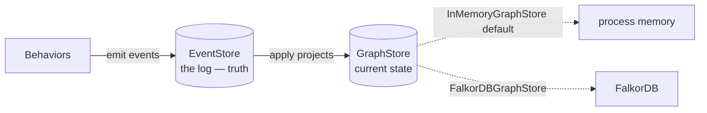

# Using the FalkorDB graph store

By default, Chronicle keeps the **materialized graph** — objects,
relations, and patches — in process memory. That projection is rebuilt
from the event log on every run, so it never needs to be durable. But
memory is not the only place it can live. `FalkorDBGraphStore` pushes
the projection into a [FalkorDB](https://www.falkordb.com/) graph so
you can query the current-state view with Cypher, share it across
processes, or keep a large graph out of your heap.

This guide is about the **graph store**, not the **event store**. They
are different seams and it is worth being precise about which is which.

---

## Two stores, two jobs

Chronicle has two distinct storage seams. Confusing them is the most
common mistake when wiring up FalkorDB.

| | `EventStore` | `GraphStore` |
|---|---|---|
| Holds | The append-only **event log** | The materialized **current-state** projection |
| Role | Source of truth — durable, replayable | A cache/view rebuilt by replaying the log |
| Default | `SQLiteEventStore` | `InMemoryGraphStore` |
| FalkorDB? | No | `FalkorDBGraphStore` |

The event log is truth. The graph store is a projection of that truth.
`FalkorDBGraphStore` is a `GraphStore` — it does **not** make your run
durable, and it is **not** a replacement for SQLite or Postgres. If the
FalkorDB graph is wiped, replaying the event log rebuilds it. For
durability and audit, keep using an `EventStore`; FalkorDB is purely
about *where the current-state view lives and how you query it*.



---

## Install

`FalkorDBGraphStore` ships with Chronicle: it owns a small,
dependency-free RESP client in `src/chronicle/falkordb_graph_store.cr`
and needs no extra shard. There is no `pip install 'activegraph[falkordb]'`
step and — unlike upstream — **no embedded fallback**.

> **Divergence (see `plans/parity.md`):** upstream offers `server mode`
> (`activegraph[falkordb]`) and `embedded mode`
> (`activegraph[falkordb-embedded]`, backed by `falkordblite`). Crystal
> has no `falkordblite` equivalent, so this backend **requires an
> explicit FalkorDB server URL**. There is no zero-infrastructure local
> engine.

Pick a server for anything beyond a quick experiment.

---

## Run a FalkorDB server

The fastest way to get a server is Docker:

```bash
docker run -d --rm -p 6379:6379 falkordb/falkordb:latest
```

That exposes FalkorDB on `localhost:6379`. FalkorDB also ships a
browser UI on port `3000` if you run the `falkordb/falkordb-bundle`
image.

---

## Connect

`FalkorDBGraphStore` takes an explicit server URL. Explicit arguments
always override the environment.

```crystal
require "chronicle"

# URL form (recommended).
store = Chronicle::FalkorDBGraphStore.new("falkor://localhost:6379")

# With graph naming (multiple runs share one server; see below).
store = Chronicle::FalkorDBGraphStore.new(
  "falkor://localhost:6379",
  graph_name: "run-42",
)

# With auth — either embedded in the URL or passed separately.
store = Chronicle::FalkorDBGraphStore.new(
  "falkor://falkordb.internal:6379",
  graph_name: "run-42",
  username: "app",
  password: "…",
)
```

### With environment variables

This is the deployment-friendly path: leave connection details out of
your code and supply them from the environment.

```bash
export FALKORDB_URL=falkor://localhost:6379
# Optional:
# export FALKORDB_USERNAME=app
# export FALKORDB_PASSWORD=…
```

```crystal
# No connection args — picks up FALKORDB_* from the environment.
store = Chronicle::FalkorDBGraphStore.new
```

Explicit arguments always override the environment, so you can set
defaults via env vars and selectively override them in code.

> **Divergence:** upstream accepts `graph=` (a caller-owned handle) or
> `host=`/`port=`/`username=`/`password=` in a fixed priority order
> with an embedded fallback. The Crystal constructor takes one URL
> (or `FALKORDB_URL`) plus optional `graph_name`, `username`, and
> `password`. There is no handle-injection mode. See `plans/parity.md`.

---

## Wire it into a graph

The graph store is injected when the projection is constructed.
Everything else — the behaviors, the runtime, the event log — is
unchanged.

```crystal
store = Chronicle::FalkorDBGraphStore.new("falkor://localhost:6379")
graph = Chronicle::GraphProjection.new(store: store)

alice = graph.add_object("person", %({"name":"Alice"}))
bob   = graph.add_object("person", %({"name":"Bob"}))
graph.add_relation(alice.id, bob.id, "knows")

graph.all_objects.each { |o| puts JSON.parse(o.data)["name"] }
# -> Alice
# -> Bob
```

Reads (`get_object`, `all_relations`, `neighborhood` walks) and the
`apply` projector route through the store transparently, so behaviors
need no changes.

### Naming graphs

Multiple runs can share one FalkorDB server by giving each its own
named graph:

```crystal
store = Chronicle::FalkorDBGraphStore.new("falkor://localhost:6379", graph_name: "run-#{run_id}")
```

`graph_name` defaults to `"chronicle"` (upstream defaults to
`"activegraph"`). Use a distinct name per run (or per tenant) to keep
their projections isolated on a shared server.

### Replaying an existing run into FalkorDB

Replay the recorded events into a FalkorDB-backed projection by
constructing the projection with the FalkorDB store and applying the
log:

```crystal
event_store = Chronicle::SQLiteEventStore.new("runs.db", run_id: "run-42")
graph = Chronicle::GraphProjection.new(store: Chronicle::FalkorDBGraphStore.new("falkor://localhost:6379", graph_name: "run-42"))
event_store.iter_events.each { |event| graph.apply(event) }
graph.attach_store(event_store)

# The log has been replayed into FalkorDB; query it with Cypher.
```

The event log in `runs.db` stays the source of truth; the graph store
only chooses where the replayed projection is materialized.

> **Divergence:** upstream `Runtime.load(..., graph_store=...)` and
> `Runtime.fork(..., graph_store=...)` accept the seam directly. The
> Crystal `Runtime.load` / `Runtime#fork` build an in-memory projection
> and do not accept a `graph_store:` argument. To run a live runtime
> whose projection is FalkorDB-backed, materialize the projection as
> above and pass it to `Chronicle::Runtime(M).new(graph: graph)`. See
> `plans/parity.md`.

---

## How entities are stored

Objects and relations form a **real graph** — relations are native
edges, so you can inspect and traverse the projection directly with
Cypher and in the FalkorDB Browser:

| Entity | Crystal shape |
|---|---|
| Object | `(:AGNode:AGObject {id, type, doc})` |
| Relation | `(s:AGNode)-[:AGRelation {id, type, doc}]->(t:AGNode)` |
| Patch | `(:AGPatch {id, doc})` |

A few deliberate choices:

- **Relations are native edges.** Every relation is an `AGRelation`
  edge between two `AGNode` endpoints, so neighborhood walks and
  visualization work natively. The relation's own kind (`links`,
  `cites`, …) is carried as the edge's `type` *property* rather than
  the relationship type — the relationship type is always the fixed
  literal `AGRelation`. That keeps every value a bound parameter
  (nothing user-supplied is ever interpolated into Cypher), at the cost
  of filtering by `r.type` instead of by relationship label.
- **Entity payloads are JSON-encoded strings.** FalkorDB properties are
  scalars, so each object/relation/patch is serialized into a `doc`
  property (the full `GraphObject` / `GraphRelation` / `Patch` JSON,
  including its `data`, `version`, and `provenance`). The store decodes
  them back into rich values on read.
- **Dangling relations are supported via placeholders.** The in-memory
  store allows a relation to reference objects that do not exist yet.
  Here, `put_relation` creates each missing endpoint as a bare
  `:AGNode` **placeholder** (an `:AGNode` *without* the `:AGObject`
  label). When the object is later added, the same node is promoted in
  place; when a relation is removed, any endpoint left as an orphaned
  placeholder is garbage-collected. Placeholder-ness is derived
  (`:AGNode AND NOT :AGObject`), never a stored flag.
- **`source` / `target` are not stored.** They fall out of the edge's
  endpoints, so the graph is the single source of truth for
  connectivity.
- **Cascade-on-removal lives in the projector, not the database.**
  Removing an object deletes its relations via `GraphProjection#apply`,
  so the behavior is identical across every `GraphStore`.
- **Structural `GraphProjection` queries push down to Cypher.** Type
  filters (`graph.objects(type: ...)`), relation lookups
  (`graph.relations(...)`), neighborhood walks
  (`graph.neighborhood(...)`), and whole pattern chains
  (`graph.match_chain(...)`, the engine behind behavior pattern
  matching) are translated into Cypher and evaluated inside FalkorDB,
  so they fetch only the matching rows instead of scanning the whole
  projection. A multi-hop pattern collapses into a single
  index-backed query rather than one round-trip per hop.
- **`where` predicates still run in Crystal.** `graph.objects(where:
  ...)` pushes the *type* filter down but applies the `where` clause
  over the returned objects, because the structured data payload is
  stored as a JSON string rather than as native, indexable properties.
  Likewise a pattern's node `{prop: value}` equality and `WHERE` clause
  are applied in Crystal over the chains `match_chain` returns. Other
  whole-graph consumers (diffing, prompt building, fork comparison,
  status) still read the full projection via `all_objects` /
  `all_relations`.

Every value crosses the Cypher boundary through the driver's
`CYPHER name=value` query prelude, never via string interpolation —
object ids, types, and payloads cannot inject Cypher.

To poke at a run's projection by hand:

```cypher
// All objects of a given type.
MATCH (o:AGObject {type: 'person'}) RETURN o.id, o.doc

// A node and what it points at, via the native edge.
MATCH (s:AGNode {id: $id})-[r:AGRelation]->(t:AGNode)
RETURN t.id, r.type

// Filter relations by kind (the kind is an edge property).
MATCH (s)-[r:AGRelation {type: 'cites'}]->(t) RETURN s.id, t.id
```

> **Divergence:** upstream stores objects as
> `(:AGNode:AGObject {id, type, version, data, provenance})` and
> relations as `(s)-[:AGRelation {id, type, data, provenance}]->(t)`,
> with separate scalar properties. The Crystal store keeps the raw
> entity JSON in a single `doc` property (the `identity`/`type`/`doc`
> split), which preserves byte-stable payloads. See `plans/parity.md`.

---

## Performance: where the seam pays off

The two backends optimize for opposite things, and the trade-off only
becomes visible as the graph grows. `InMemoryGraphStore` is
heap-resident: every read is a pointer chase with no serialization and
no network hop. `FalkorDBGraphStore` pays a fixed round-trip-plus-JSON
cost on every call, but the **pushed-down** reads run as index-backed
Cypher inside the database, so their cost tracks the size of the
**result**, not the size of the whole projection.

The numbers below come from upstream's
`scripts/benchmark_falkordb.py` (a local FalkorDB container over
loopback, one machine). They are **indicative and hardware-dependent**
and are reproduced here for the *ratios between rows*, not the absolute
milliseconds. The Crystal client has comparable round-trip behavior;
the port does not ship its own benchmark script.

| Operation | Size (objects) | InMemory (ms) | FalkorDB (ms) |
|---|---|---|---|
| build (write) | small (200) | 2.96 | 231 |
| full scan (`all_objects`) | small (200) | <0.01 | 1.91 |
| type-scoped read | small (200) | <0.01 | 0.67 |
| neighborhood depth=2 | small (200) | 0.01 | 1.05 |
| 2-hop pattern match | small (200) | 0.87 | 3.03 |
| cascade delete | small (200) | 0.02 | 3.14 |
| build (write) | medium (2,000) | 30.8 | 2,067 |
| full scan (`all_objects`) | medium (2,000) | 0.01 | 18.9 |
| type-scoped read | medium (2,000) | 0.04 | 4.69 |
| neighborhood depth=2 | medium (2,000) | 0.11 | 0.85 |
| 2-hop pattern match | medium (2,000) | 80.4 | 27.1 |
| cascade delete | medium (2,000) | 0.10 | 5.88 |
| build (write) | large (20,000) | 273 | 26,595 |
| full scan (`all_objects`) | large (20,000) | 0.05 | 97.3 |
| type-scoped read | large (20,000) | 0.31 | 50.0 |
| neighborhood depth=2 | large (20,000) | 1.07 | 0.94 |
| 2-hop pattern match | large (20,000) | 8,920 | 300 |
| cascade delete | large (20,000) | 0.98 | 40.3 |

What the table is telling you:

- **In-memory wins raw latency on small and medium graphs, and always
  wins on writes.** With no serialization and no network, operations are
  sub-millisecond. Every FalkorDB write is a round-trip, so building a
  large projection edge-by-edge is the backend's worst case (the ~27 s
  build is one-time setup cost, not query cost). If your projection fits
  comfortably in memory and is short-lived, `InMemoryGraphStore` is
  simply faster.
- **The pushed-down structural reads flip the comparison as the graph
  grows.** A 2-hop pattern match over 20,000 objects collapses into a
  single index-backed Cypher query (~300 ms) instead of the matcher's
  whole-projection walk (~8.9 s) — roughly **30× faster**, and the gap
  widens with size because FalkorDB's cost scales with matches, not
  nodes. `neighborhood` is already on par at the large size for the
  same reason.
- **The un-pushable paths stay proportional to graph size on both
  backends.** A full `all_objects` scan, and the Crystal-side consumers
  that depend on it (diffing, prompt building, `where` predicates),
  pull the whole projection across the wire and JSON-decode it, so
  FalkorDB is slower there — that's the cost of keeping a large graph
  off the heap.

The rule of thumb: reach for FalkorDB when the graph is **large and
long-lived** and your hot path is **structural queries** (type filters,
neighborhoods, pattern-driven behaviors) — exactly the paths that push
down. Stay in memory when the projection is small, write-heavy, or
disposable.

> **This is a latency win, not a token win.** These optimizations change
> *how the projection is queried*, not *what the LLM sees*. Both
> backends produce a byte-for-byte identical `View` for the same
> `view_spec`, so the serialized prompt — and its token count — is the
> same either way. LLM token usage is bounded by **view scoping**
> (`include_types`, `around` + `depth`), which decides what lands in the
> prompt. The push-down just makes producing that scoped slice cheap on
> a large graph, instead of pulling the whole projection into memory to
> trim it down.

---

## Lifecycle and cleanup

When the store opened its own connection, `close` releases it:

```crystal
store = Chronicle::FalkorDBGraphStore.new("falkor://localhost:6379")
begin
  graph = Chronicle::GraphProjection.new(store: store)
  # ...
ensure
  store.close
end
```

`clear` detaches and wipes only this graph's `AGNode` (objects +
placeholders, with their `AGRelation` edges) and `AGPatch` nodes,
leaving anything else in the FalkorDB graph untouched.

---

## Why there's no CLI flag for it

`FalkorDBGraphStore` is a **library-level** choice — you wire it in when
you construct the graph projection. The `chronicle-cli` deliberately
does **not** expose a `--graph-store` option, and that is by design, not
an omission.

The reason is the two-seam split this guide opened with. The CLI's
storage flags select an **`EventStore`** (the durable log) because every
CLI command — `log inspect`, `replay`, `fork`, `diff`, `trace` — reads
*the log*. The log is the artifact operators carry around, so choosing
where it lives belongs on the operator surface.

A `GraphStore` is the opposite kind of thing: a **disposable
projection**, rebuilt from the log on every run. Routing the CLI's
read-only commands through FalkorDB would mean standing up an external
database only to materialize a projection that's discarded when the
command exits — adding required infrastructure to commands that are
designed to need none.

It also wouldn't buy you anything. FalkorDB's value — querying current
state with Cypher, sharing the projection across processes, keeping a
large graph off the heap — only applies to a **live, long-running run**.
The CLI doesn't drive those; it inspects an existing event log. Live
runs happen in a Crystal entry point, which is exactly where
`GraphProjection.new(store: ...)` lives. So FalkorDB is used where it
pays off, and the CLI stays infrastructure-light.

---

## When to reach for it

Use `FalkorDBGraphStore` when you want to:

- **Query current state with Cypher** — dashboards or ad-hoc queries
  over the live projection. Relations are native `AGRelation` edges
  between `AGNode` endpoints, so neighborhood walks and edge-traversal
  queries work natively; filter a relation's kind on its `type`
  *property*.
- **Share the projection across processes** — one writer plus several
  read-only inspectors hitting the same FalkorDB graph.
- **Keep a large graph off the heap** — projections that don't fit
  comfortably in process memory.

Stick with the default `InMemoryGraphStore` when none of that applies.
It is faster, has zero dependencies, and is rebuilt from the event log
just the same. Remember: whichever store you choose, **durability and
audit come from the `EventStore`, not from here** — see
[Operating in production](operating-in-production.md) for the
persistence and replay story.
